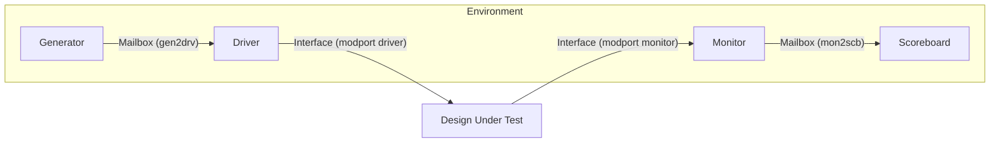

# SystemVerilog Verification: 8-bit Digital Comparator

This repository contains a complete **SystemVerilog verification environment** for a parameterizable Digital Comparator. The project demonstrates a layered testbench architecture (similar to UVM phases) to verify that the Design Under Test (DUT) correctly compares two N-bit inputs.

## 📌 Project Overview

* **Design Under Test (DUT):** N-bit Digital Comparator (Default N=8)
* **Verification Methodology:** SystemVerilog OOP (Object Oriented Programming)
* **Architecture:** Layered Testbench (Generator, Driver, Monitor, Scoreboard)
* **Communication:** Mailboxes for data transaction and Events for synchronization

## 🏗️ Testbench Architecture

The testbench is organized into a modular environment where components communicate via **mailboxes** and **interfaces**.



### Key Features

* **Randomized Stimulus:** Uses `randc` (random-cyclic) in the transaction class to ensure inputs `a` and `b` cover a wide range of values without immediate repetition
* **Golden Reference Model:** The `scoreboard.sv` contains a reference model that independently calculates the expected `lt`, `eq`, and `gt` flags to verify the DUT's output
* **Event Synchronization:** The driver triggers a `sample_enable` event in the interface to notify the monitor exactly when to sample the stable output, preventing race conditions

## 📂 File Structure

| File | Type | Description |
|------|------|-------------|
| `design.sv` | RTL | The 8-bit comparator logic (a<b, a>b, a==b) |
| `interface.sv` | Interface | Defines signals and modports (dut, driver, monitor) |
| `transaction.sv` | Class | Defines the packet with randc inputs and signal constraints |
| `generator.sv` | Class | Generates transaction objects and puts them in the gen2drv mailbox |
| `driver.sv` | Class | Gets transactions from mailbox and drives signals to the interface |
| `monitor.sv` | Class | Waits for sample_enable, captures outputs, and sends to scoreboard |
| `scoreboard.sv` | Class | Compares DUT outputs against the expected logic and reports Pass/Fail |
| `environment.sv` | Class | Builds all components and connects mailboxes/interfaces |
| `top.sv` | Top Module | Connects the DUT and Environment; initiates the test |

## ⚙️ How It Works

1. **Top Level:** The `tb_top` module instantiates the interface and the comparator DUT. It creates the environment and passes the virtual interface handle
2. **Generation:** The generator creates randomized transaction packets. In `top.sv`, the test is configured to run for 25 transactions
3. **Driving:** The driver applies inputs `a` and `b` to the interface. It waits 5 time units, triggers the `sample_enable` event, and waits another 5 units
4. **Monitoring:** The monitor waits for the `sample_enable` event. When triggered, it samples the DUT's response and packs it into a transaction object
5. **Checking:** The scoreboard retrieves the monitored transaction. It calculates the expected result logic (e.g., if a < b, then expected_lt should be 1) and compares it with the actual DUT result

## 📊 Simulation Output

When you run the simulation, the console will display the transaction flow and the final scoreboard report.

### Expected Log:

```
===========================================
Starting comparator Testbench
===========================================
[GENERATOR] Starting generation of 25 transactions
[DRIVER] Starting driver
[MONITOR] Starting monitor
[GENERATOR] Generated Trans #1: A=12, B=45
[Monitor] Captured: A = 12, B = 45, A < B = 1, A == B = 0, A > B = 0
[SCOREBOARD] PASSED: A = 12, B = 45, A < B = 1, A == B = 0, A > B = 0
...
...
[GENERATOR] Generation complete
===========================================
[SCOREBOARD] Test Results:
  PASSED: 25
  FAILED: 0
  TOTAL:  25
===========================================
Testbench Complete
===========================================
```

## 🛠️ How to Run

You can simulate this project using any standard SystemVerilog simulator (Vivado, QuestaSim, VCS, or EDA Playground).

1. Compile all `.sv` files
2. Set `tb_top` as the top-level simulation module
3. Run the simulation

## 📝 Customization

### Change Data Width
Modify the `N` parameter in `design.sv` and `interface.sv` (Default is 8)

### Change Test Length
Update the number of transactions in `top.sv` where the environment is instantiated:

```systemverilog
env = new(inf, 50); // Run 50 transactions
```

## 📄 License

This project is open source and available under the MIT License.

## 🤝 Contributing

Contributions, issues, and feature requests are welcome! Feel free to check the issues page.

## 📧 Contact

For questions or feedback, please open an issue in this repository.
